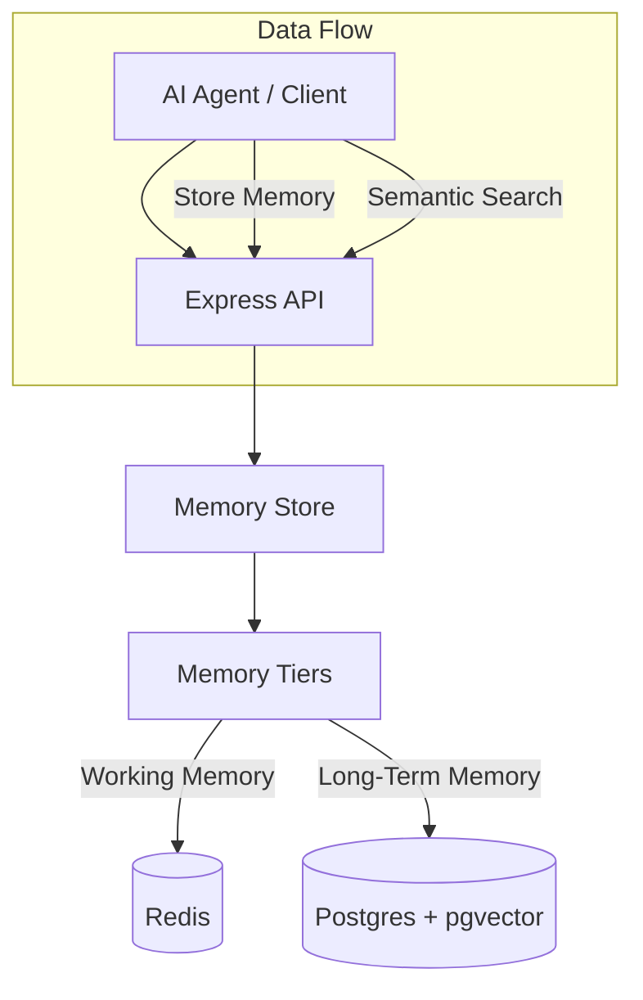

# PersistAI Architecture

## System Overview

PersistAI acts as a cognitive layer for AI agents, providing both short-term context and long-term knowledge retrieval.

### Diagram

## Core Components

1.  **Memory Store**: Facade for all memory operations.
2.  **Memory Tiers**: Routing logic based on memory type (factual vs episodic).
3.  **Adapters**:
    - `RedisAdapter`: High-speed access, TTL management.
    - `PostgresAdapter`: Vector similarity search, metadata querying.

## Database Schema

**Memories Table**

- `id`: UUID
- `content`: Text (truncated > 100kb)
- `embedding`: Vector(1536)
- `type`: 'factual' | 'episodic' | 'procedural' | 'semantic'
- `metadata`: JSONB
